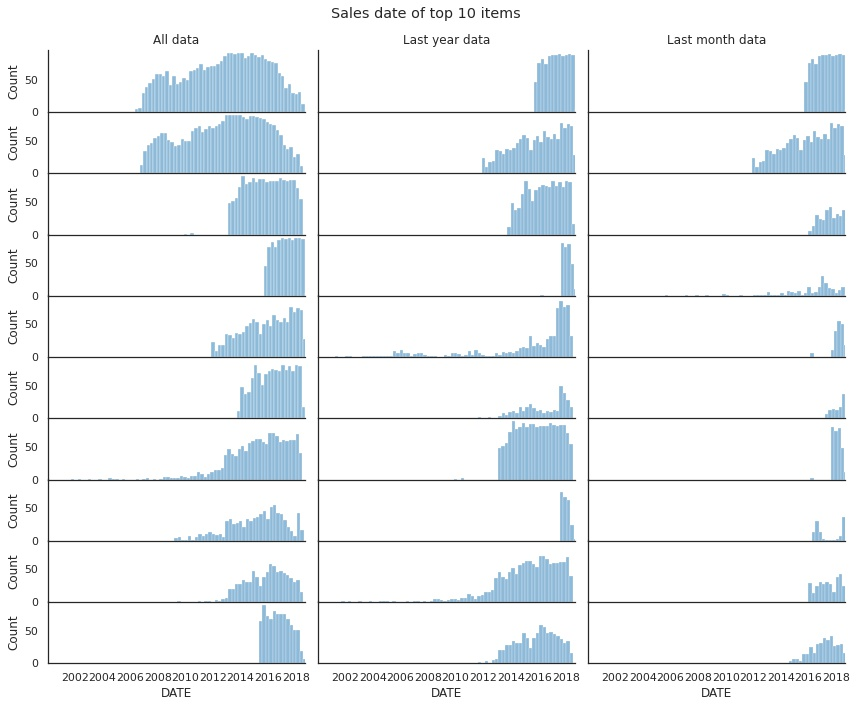
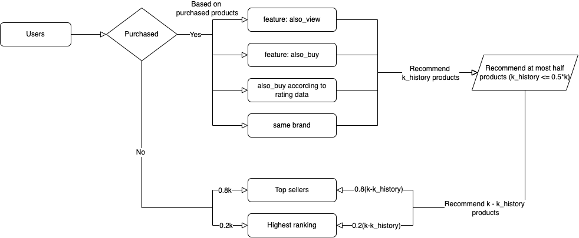

# data-course-sample

# Week1
## 專案目的

使用「使用者購買商品紀錄」以及「商品基本資訊」，以建立規則的方式，為指定的使用者推薦 k 個其可能有興趣的商品，並以使用者**是否實際購買推薦商品**作為評價的指標。

## 工具

Python, Google Colab

## 資料描述

- All_Beauty.csv ([link](http://deepyeti.ucsd.edu/jianmo/amazon/categoryFilesSmall/All_Beauty.csv))：提供使用者購買商品的評論紀錄
    - 資料區間：2000-01-10 - 2018-10-02 (共 371345)
    - 依據時間區間，拆分成訓練資料及測試資料：
        - 訓練資料：2000-01-10 - 2018-09-01 (共 370752)
        - 測試資料：2018-09-01 - 2018-09-30 (共 590)
- meta_All_Beauty.json.gz ([link](http://deepyeti.ucsd.edu/jianmo/amazon/metaFiles2/meta_All_Beauty.json.gz))：提供商品的基本資訊
    - 共 32892 個商品

## 資料清洗

商品基本資訊 `meta_All_Beauty.json`：

- 空值及商品基本資訊重複的處理
- 銷售排行 `rank` 的處理，其中移除了非屬 Beauty & Personal Care 類別的商品 （數量僅佔全部商品的大約 1.5%)
- 價格 `price` 數值處理

購買商品的評論紀錄 `All_beauty.csv`:

- 同樣移除非屬 Beauty & Personal Care 類別的商品 （數量僅佔約 2%)

## 資料探索與思考邏輯

- 商品基本資訊中有紀錄相關商品，包含 `also_buy`, `also_view`, `brand` 等可用資訊
    - `brand` 問題：92.5% 的品牌都只擁有 < 5 個商品
- 由於 61.5% 的訂單都得到 5 顆星評價，79.3% 商品的平均評價皆 ≥ 3，認為高評價可能沒有辦法有效區隔商品，故以下規則會以「排除評價過低的商品」的邏輯來做推薦
- 排名 (rank) 前面的商品不見得銷量高，但銷量高的商品的確排名較前面，推測可能可以使用排名來抓出部分有潛力衝高銷量的商品。
- 由購買資料中可以看出過去夠購買過相同商品的使用者也買過哪些商品，可由此推知出使用者購物習性，並嘗試使用類似購物籃分析(Basket analysis) 的方式來進行交叉銷售。
    - 此特徵問題：88.7% 有購買的使用者只購買過一次
- 訂單整體多集中 2014 年底之後，且商品熱銷期間會隨時間改變：
    
    下圖各欄分別為過去所有期間（18年）、過去一年、過去一個月的銷售量前十名商品，依據時間軸的銷售數量分布。
    
    可以發現**所有期間**的 Top 10 商品銷售量高峰多在數年前 (2012年左右），近期的銷售量有下降的趨勢；若將時間區間限縮到**最近一個月**，銷售量排名前 10 的商品有較明顯的成長趨勢，由此推測使用近一個月的 Top 10 商品較能抓到近期潮流，進而吸引使用者下單。
    

## 推薦規則

### 規則一：過去一年 Top k 熱銷品

依據購買商品評論紀錄的資料 (`All_Beauty.csv`)，計算**過去一年**的銷售出最多次的 k 個商品。

### 規則二：過去一個月 Top k 熱銷品

和規則一相同，但將資料時間區間從一年縮短到**過去一個月**。

### 規則三：綜合過去一年的購買紀錄及熱銷品

依照**過去一年**的資料，排除平均評分 < 3 的商品後，分成兩部分規則來做商品推薦，第一部分為和**過去購買紀錄相關**的商品，第二部分為**平台熱門好評商品**。若使用者有購買紀錄，則最多推薦一半的購買紀錄相關商品，剩下則推薦平台熱門好評商品；若使用者為新用戶（無購買紀錄），則全數推薦平台熱門好評商品。

- 購買紀錄相關商品推薦指標——至多推薦一半 (k_history <= 0.5*k 個) 的商品，以越前面的指標為優先 (e.g. also_buy 優先於 also_view)： 
    1. 商品基本資訊資料中的 `also_buy` 欄位  
    2. 商品基本資訊資料中的 `also_view` 欄位  
    3. 從過去購買資料中，找出曾買過相同商品的使用者也買過哪些商品 
    4. 若該購買的商品在商品基本資訊資料中有記錄到 `brand` ，找出相同的品牌的商品  
    
- 平台熱門好評商品的推薦指標——假設推薦 `k - k_history` 個商品，對於無購買紀錄的使用者 k_history = 0：  
    1. 依據商品基本資料，找出銷售排行 (`rank`) 最前的 0.1 * (k - k_history) 個商品     
    2. 依據過去購買資料，找出銷售量最高的前 0.8 * (k - k_history) 個商品  
    

### 規則四：綜合過去一個月的購買紀錄及熱銷品  

和規則三相同，但將資料時間區間從一年縮短到**過去一個月**。

## 最終推薦分數

成功推薦給使用者 k 個商品，最終以規則二——過去一個月 Top k 熱銷品——得到最高的分數：0.1576  

四個規則的分數分別如下表：  
規則 | 分數
--- | ---
規則一 | 0.0983
規則二 | 0.1576
規則三 | 0.0983
規則四 | 0.1356
